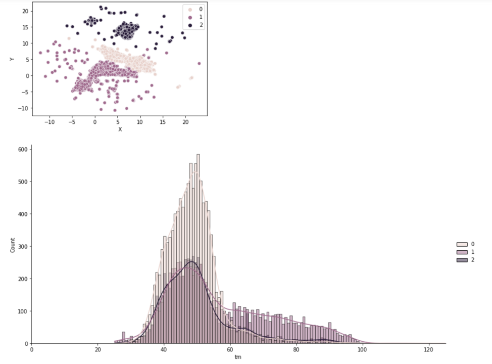

## Abstract

Enzymes are essential in catalysing chemical reactions. Biotechnology has a basic challenge in trying to understand and reliably predict protein stability. Enzyme engineering can be used to address issues like sustainability, carbon neutrality, and other global challenges and hence enzyme stability improvements may save expenses and speed up concept iteration for scientists. The analyse data from Kaggle competition which involves the prediction of thermostability of enzyme variants (regression). The experimentally measured data includes natural sequences, as well as engineered sequences with single or multiple mutations upon the natural sequences. We used linear and ensemble methods to analyse it and also attempted 

## Introduction

The dataset has only 4 variables: protein sequences, the pH levels, organization from which the experimental data was acquired and the melting temperature (target variable). Give the simplicity of the dataset and the few missing values (only in organisations column), EDA was restricted to visualization and distribution temperature and pH to begin with.

The dataset has more than 30 thousand examples and the target(temperature) is distributed is normally around 50, showing that it is a good representation of the problem for us to train a model. The distribution of temperature with respect to pH values is evenly distributed with slight skew to the left, meaning it is representative across other variables.

The protein sequence are a sequence of letters indicating amino acid. We have to create new features using NLP methods in order to study them.
  
## Methods
1.	Advanced EDA using language model ProtBert  
   
BERT is an open source machine learning framework for Natural Language Processing (NLP) to help computers understand the meaning of ambiguous language in text by using surrounding text to establish context. ProtBert is based on the Bert model which pre-trained on a large corpus of protein sequences in a self-supervised fashion. This model could be used for protein feature extraction or to be fine-tuned on downstream tasks. It has been noticed in some tasks you could gain more accuracy by fine-tuning the model rather than using it as a feature extractor.

For this analysis, we are dropping sequences that are too long to save the GPU memory. Plots before and after dropping show a better distribution and that most of the sequences have length between 200 and 850.

Before Drop            |  After Drop
:-------------------------:|:-------------------------:
|

Dimentionality reduction methods like UMAP can be used on features generated using the model to reduce the dataset to two dimensions to observe patterns.  
![UMAP] (images/umap.png)
It’s clear that there are clusters which can be grouped using clustering algorithms like k-means and Guassian Mixture Analysis.

k-means(n=3) |  Guassian Mixture
:-------------------------:|:-------------------------:
|

2. Linear Methods

We also used linear modelling to get a baseline. It was observed that training data (protein sequences) contains mutations while the test data contains "only" mutations. For the linear models to learn well, they have to be grouped properly in the KFold cross-validation technique. We used Levenshtein Distance to calculate edit distance between each set of pairs and assigned group numbers to each sequence based on a small threshold length in terms of insertions or deletions. 

Most of the sequence in the new data set did not fall into the 410 groups  that were created and were spread over rest of the groups. Basic feature extraction using, 'CountVectorizer' from sklearn were used to performed vanilla Linear Regression on. The results were not that encouraging: average spearmann Correlation Score for GroupKFold was 0.227
On the training set. We then tried other methods like 'TdidfVectorizer' and used Ridge Regression on the resulting feature set. The results were better than Linear Regression with the mean correlation score improving to 0.35. The basic EDA performed to get these results were taking a lot of time to train since ‘sklearn’ was a CPU based library, we didn’t continue using these basic NLP features extraction methods. 
In terms of feasibility of learning, while the training score improved using ridge regression, it was well below scores generated by other methods and pointed towards more complex relationship between unknown features.

3. Random Forests  
  
This ensemble methods using decision tree regressors was fit on data with slightly different features; missing values were imputed and the organizations were encoded to see if the samples were affected based on the lab where they were measured. As usual there was lot of overfitting with respect to training data, since the accuracy was unusually high.  The number of estimators used were over 500 and the in sample error were very low; it’s a case of overfitting. Hyper-parameter search should be done in order to get reasonable results.

4. XGBoost 
  
This class of ensemble learning method, also known as gradient boosting can be is known for performing at the top in terms of competitions. Execution speed and model performance are the two primary benefits of using XGBoost. 
In terms of EDA, a Python tool ‘protolearn’ was used extracting features from protein sequences . The pre-processing module enables user to prepare the datasets in accordance with certain requirements, such as removing sequences that include unnatural amino acids or changing alphabetical strings into integers, amongst other things. Custom functions were written to find features like amino acid composition, AAIndex1-based physicochemical properties, Atomic and bond composition etc.   
Given the default number of estimators, results from this method were had a MSE of 73.4385597517905; variation in terms of temperature is larger on the training set. The method performs better than Random Forests but it can be improved with further parameter search.

## Conclusions
Linear methods performed the least compared to other ensemble methods. The error rate were improving when choosing ridge regression (regularization) but the baseline was still too low. Random Forest were overfitting and XGBoost, unsurprisingly performed the best. The latter methods can improve with hyper-parameter search which was a constraint given the compute resources available. ProtBert based feature engineering show promising results in terms of pre-processing and we would like to continue working with these transformer-based NLP models to find latent structures in protein sequence.
