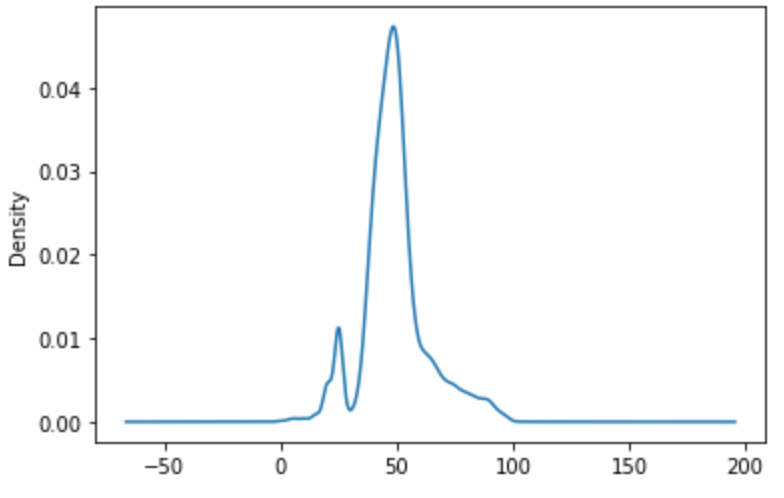
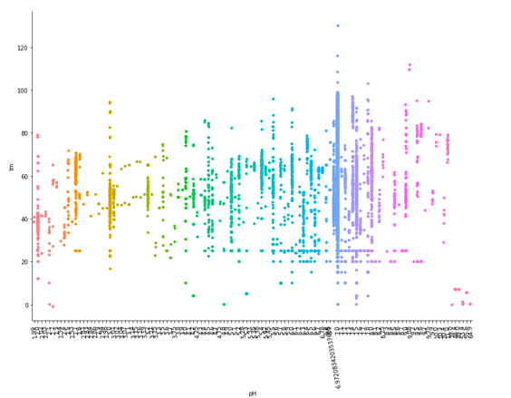
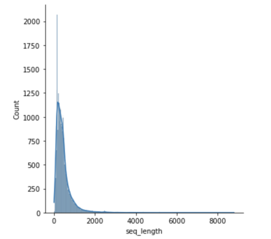
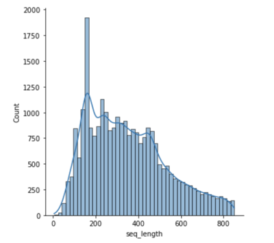
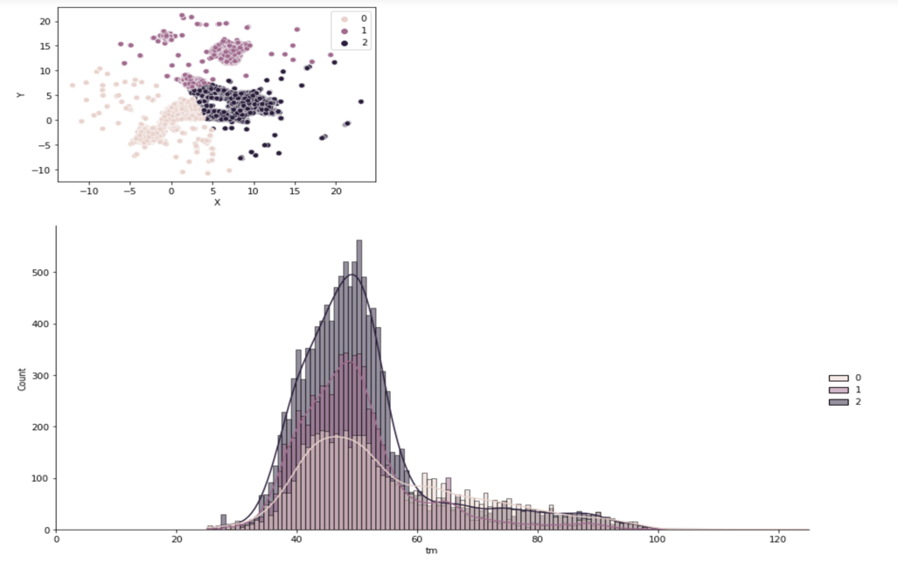

# Abstract

Enzymes are essential in catalysing chemical reactions. Biotechnology has a basic challenge in trying to understand and reliably predict protein stability. Enzyme engineering can be used to address issues like sustainability, carbon neutrality, and other global challenges and hence enzyme stability improvements may save expenses and speed up concept iteration for scientists. The analyse data from Kaggle competition which involves the prediction of thermostability of enzyme variants (regression). The experimentally measured data includes natural sequences, as well as engineered sequences with single or multiple mutations upon the natural sequences. We used linear and ensemble methods to analyse it and also attempted 

# Introduction

The dataset has only 4 variables: protein sequences, the pH levels, organization from which the experimental data was acquired and the melting temperature (target variable). Give the simplicity of the dataset and the few missing values (only in organisations column), EDA was restricted to visualization and distribution temperature and pH to begin with.

The dataset has more than 30 thousand examples and the target(temperature) is distributed is normally around 50, showing that it is a good representation of the problem for us to train a model. The distribution of temperature with respect to pH values is evenly distributed with slight skew to the left, meaning it is representative across other variables.

The protein sequence are a sequence of letters indicating amino acid. We have to create new features using NLP methods in order to study them.
# Methods
1.	Advanced EDA using language model ProtBert.  
BERT is an open source machine learning framework for Natural Language Processing (NLP) to help computers understand the meaning of ambiguous language in text by using surrounding text to establish context. ProtBert is based on the Bert model which pre-trained on a large corpus of protein sequences in a self-supervised fashion. This model could be used for protein feature extraction or to be fine-tuned on downstream tasks. It has been noticed in some tasks you could gain more accuracy by fine-tuning the model rather than using it as a feature extractor.

For this analysis, we are dropping sequences that are too long to save the GPU memory. Plots before and after dropping show a better distribution and that most of the sequences have length between 200 and 850.

Before Drop            |  After Drop
:-------------------------:|:-------------------------:
|

Dimentionality reduction methods like UMAP can be used on features generated using the model to reduce the dataset to two dimensions to observe patterns.  
![UMAP] (images/umap.png)
It’s clear that there are clusters which can be grouped using clustering algorithms like k-means and Guassian Mixture Analysis.

k-means(n=3) |  Guassian Mixture
:-------------------------:|:-------------------------:
|

# Comparisons

# Example Analysis

# Conclusions

# References
